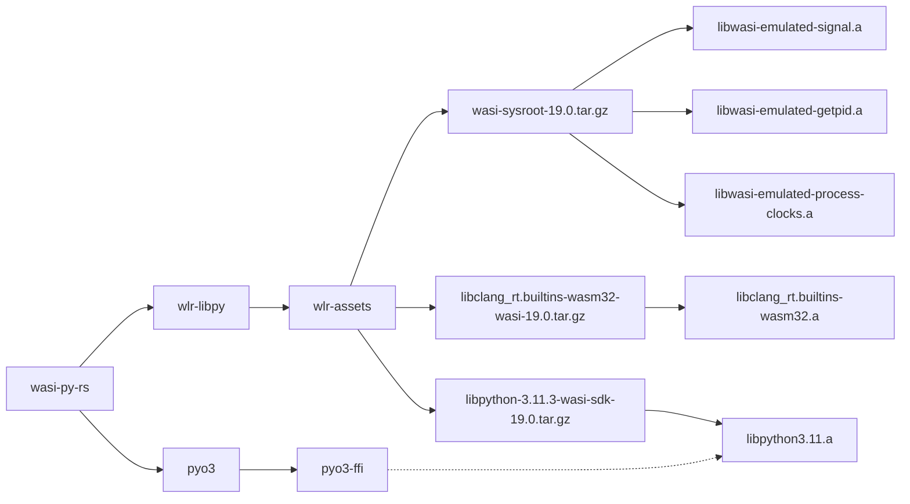

# About

Example that embeds CPython via libpython into a Wasm module written in Rust.

Offers a couple of WASI Command (exporting `_start`) Wasm modules, written in Rust and demonstrates interaction with simple Python code via [pyo3](https://pyo3.rs/v0.19.0/).

# How to run

Make sure you have `cargo` with the `wasm32-wasi` target. For running we use `wasmtime`, but the module will work with any WASI-compliant runtime.

Just run `./run_me.sh` in the current folder. You will see something like this

```
wlr/python/examples/embedding/wasi-py-rs $$ ./run_me.sh
   Compiling pyo3-build-config v0.18.3
   ...
    Finished dev [unoptimized + debuginfo] target(s) in 26.43s

Calling a WASI Command which embeds Python (adding a custom module implemented in Rust) and calls a custom function:
+ wasmtime --mapdir /usr::target/wasm32-wasi/wasi-deps/usr target/wasm32-wasi/debug/py-func-caller.wasm
Hello from Python (libpython3.11.a / 3.11.3 (tags/v3.11.3:f3909b8, Apr 28 2023, 09:45:45) [Clang 15.0.7 ]) in Wasm(Rust).
args= (('John', 21, ['male', 'student']), ('Jane', 22, ['female', 'student']), ('George', 75, ['male', 'retired']))
Original people: [Person(Name: "John", Age: 21, Tags:["male", "student"]), Person(Name: "Jane", Age: 22, Tags:["female", "student"]), Person(Name: "George", Age: 75, Tags:["male", "retired"])]
Filtered people by `student`: [Person(Name: "John", Age: 21, Tags:["male", "student"]), Person(Name: "Jane", Age: 22, Tags:["female", "student"])]
+ set +x

Calling a WASI Command which wraps the Python binary (adding a custom module implemented in Rust):
+ wasmtime --mapdir /usr::target/wasm32-wasi/wasi-deps/usr target/wasm32-wasi/debug/py-wrapper.wasm -- -c 'import person as p; pp = [p.Person("a", 1), p.Person("b", 2)]; pp[0].add_tag("X"); print("Filtered: ", p.filter_by_tag(pp, "X"))'
Filtered:  [Person(Name: "a", Age: 1, Tags:["X"])]
+ set +x
```

# About the code

To see how you can expand this example start with `pyo3`'s documentation on [calling Python from Rust](https://pyo3.rs/v0.18.3/python_from_rust).

The main purpose here is to show how to configure the build and dependencies.

The code has the following structure:

```
src
├── bin
│   ├── py-func-caller.rs  -  A WASI command which defines and calls a Python function that uses the "person" module.
│   └── py-wrapper.rs  -  A wrapper around Py_Main, which adds "person" as a built-in module.
├── lib.rs  -  A library that allows one to call a Python function (passed as text) with arbitrary Rust Tuple arguments.
└── py_module.rs  -  A simple Python module ("person") implemented in Rust. Offers creation and tagging of people via the person.Person class.
```

# Build and dependencies

For pyo3 to work the final binary needs to link to `libpython3.11.a`. The WLR project provides a pre-build `libpython` static library (based on [wasi-sdk](https://github.com/WebAssembly/wasi-sdk)), which depends on `wasi-sdk`. To setup the build properly you will need to provide several static libs and configure the linker to use them properly.

We provide a helper crate [wlr-libpy](../../../tools/wlr-libpy/), which can be used to fetch the pre-built libpython.

Take a look at [Cargo.toml](./Cargo.toml) to see how to add it as a build dependency:

```toml
[build-dependencies]
wlr-libpy = { git = "https://github.com/vmware-labs/webassembly-language-runtimes.git", features = ["build"] }
```

Then, in the [build.rs](./build.rs) file we only need to add this to the `main` method:

```rs
fn main() {
    // ...
    use wlr_libpy::bld_cfg::configure_static_libs;
    configure_static_libs().unwrap().emit_link_flags();
    // ...
}
```

This will ensure that all required libraries are downloaded and the linker is configured to use them.

Here is a diagram of the relevant dependencies

